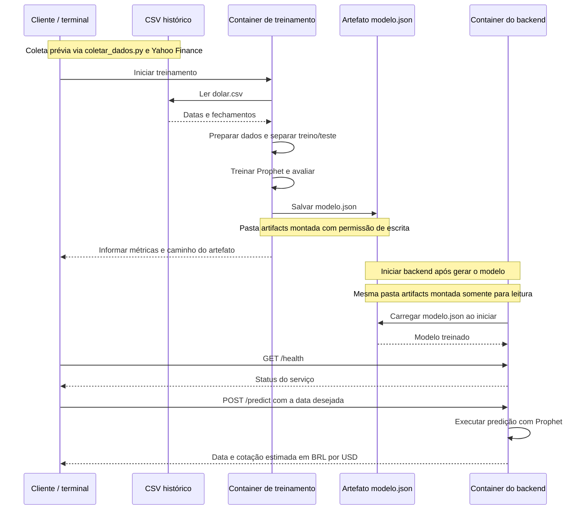
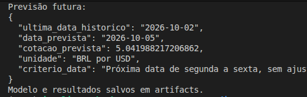
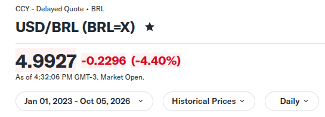
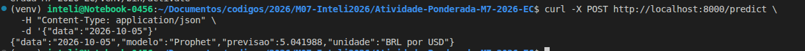

# Atividade-Ponderada-M7-2026-EC

**Nome:** Stefanne Victória Andrade Soares

## Objetivo e escolhas iniciais

Esta atividade tem como objetivo desenvolver uma solução para estimar a cotação futura do **dólar** em reais, utilizando dados históricos do [Yahoo Finance](https://finance.yahoo.com/quote/BRL%3DX/history/?period1=1672531200&period2=1791221071). 

- **Fonte dos dados:** Yahoo Finance, ticker [`BRL=X`](https://finance.yahoo.com/quote/BRL%3DX/history/?period1=1672531200&period2=1791221071).
- **Período solicitado na coleta:** de 01/01/2023 até 05/10/2026, sem incluir a data final.
- **Última observação disponível:** 02/10/2026
- **Colunas baixadas:** `date` e `close`.
- **Horizonte da previsão:** próxima observação disponível (não é necessariamente o próximo dia corrido).


## Arquitetura 


O diagrama representa o fluxo entre treinamento e inferência que será realizado. O container de treinamento lê o CSV histórico do dólar (baixado por um script pelo site do Yahoo), prepara os dados, separa treino e teste cronologicamente e treina o Prophet. Depois, salva o modelo em JSON na pasta artifacts. O container do backend acessa essa pasta somente para leitura e carrega o modelo ao iniciar. O usuário (cliente) pode verificar se o serviço está ativo e enviar uma data para receber a cotação estimada, sem executar novamente o treinamento.


## Modelo

> **Aviso:** Os códigos de scripts e outros foram desenvolvidos principalmente com o auxílio de Inteligência Artificial (IA) para aumentar a eficiência e manter o foco na lógica de desenvolvimento da atividade. 

O modelo escolhido foi o **Prophet** pois é uma ferramenta voltada à previsão de séries temporais e foi o sugerido pelo professor Murilo. Ele permite treinar com datas e valores históricos e exportar o modelo para uso no backend.

Seguindo a arquitetura acima, foi criado um script `scripts/coletar_dados.py` para baixar os dados históricos da cotação do dólar diretamente do site Yahoo Finance, dentro do período definido (01/01/2023 até 05/10/2026). Após isso, foi criado o script `scripts/treinar.py` que realiza o treinamento do modelo, avalia e salva métricas e previsões de teste. 

O treinamento foi colocado em um container para executar com o código e as dependências definidos na imagem. Os resultados são salvos em uma pasta compartilhada, permitindo que o backend carregue o modelo depois, sem precisar treinar ele de novo.

Separei os dados cronologicamente e avaliei as últimas 20 observações, retreinando antes de cada observação. A cada etapa o modelo utiliza somente os dados anteriores a data que vai ser prevista. Depois dessa previsão, o valor real observado entra no histórico usado para prever a próxima observação. Escolhi essa avaliação para simular previsões de uma próxima observação por vez usando somente o passado.

Também coloquei o Naive como referência para comparar as métricas. Ele usa o último fechamento observado como previsão para a próxima observação. Essa comparação permite verificar se o Prophet teve um resultado melhor que uma abordagem mais simples.

Depois da avaliação, treinei o modelo final Prophet com todo o histórico disponível para disponibilizá-lo no backend. O Naive foi usado somente para comparação no teste, o modelo exportado e que será utilizado no backend continua sendo o Prophet.

O retreinamento antes de cada observação acontece durante a avaliação. No backend, o modelo final será carregado e utilizado para fazer as previsões sem retreinar a cada solicitação.

### Execução: 

1. No terminal, na raiz do projeto, construa a imagem:

```
docker build -f Dockerfile.treino -t dolar-treino:1.0 .
```

2. Executar o treinamento:

```
docker run --rm \
  -v "$(pwd)/data:/app/data:ro" \
  -v "$(pwd)/artifacts:/app/artifacts" \
  dolar-treino:1.0
```
3. Conferir os arquivos gerados:

```
ls -lh artifacts
```

### Resultados obtidos no teste: 

Após a execução do treinamento no container, os arquivos foram salvos na pasta compartilhada.





Na limpeza do script nenhum dado foi removido (ficou com 973 registros válidos). 

A avaliação foi realizada nas últimas 20 observações disponíveis, de 07/09/2026 até 02/10/2026, e apresentou os resultados:


| Métrica | Prophet | Naive |
|---|---:|---:|
| MAE (erro absoluto médio) | R$ 0,1110 | R$ 0,0218 |
| RMSE (raiz do erro quadrático médio) | R$ 0,1182 | R$ 0,0270 |

As métricas representam o erro em reais por dólar. Quanto menor o valor, menor o erro da previsão.

Nesse período, o Naive apresentou menor erro nas duas métricas e também em cada uma das 20 observações avaliadas. Portanto, nessa avaliação, o Prophet não superou a referência simples do Naive. Mesmo com esse resultado, mantive o Prophet como modelo final para demonstrar o fluxo de treinamento, exportação do artefato e inferência no backend.

O modelo final previu o dólar em aproximadamente `R$ 5,04` para 05/10/2026. Durante o desenvolvimento da atividade, a cotação estava em aproximadamente `R$ 4,99`, mas o dia ainda não tinha fechado então essa comparação não entrou nas métricas do teste.

**Limitação do modelo:** O modelo usa apenas o histórico de cotações sem considerar notícias e outros fatores que afetam o dólar.

## Backend

O backend foi desenvolvido em Python com Flask e executado em um segundo container Docker. Ao iniciar, ele carrega o modelo treinado em `artifacts/modelo.json`, usando a pasta compartilhada somente para leitura.

A rota `GET /health` verifica se o serviço está ativo e informa a última data do treinamento. A rota `POST /predict` recebe uma data e retorna a cotação prevista pelo Prophet, sem treinar novamente o modelo. A data deve ser posterior à última data usada no treinamento.

Testei as duas rotas pelo terminal com `curl`. O serviço confirmou o carregamento do modelo e retornou a previsão de R$ 5,041988 para 05/10/2026.

### Execução:

1. Construa a imagem, no terminal da raiz do projeto:

```
docker build -f Dockerfile.backend -t dolar-backend:1.0 .
```

2. Inicie o backend:

```
docker run --rm --name dolar-backend \
  -p 8000:8000 \
  -v "$(pwd)/artifacts:/app/artifacts:ro" \
  dolar-backend:1.0
```

3. Em outro terminal, teste o serviço:
```
curl http://localhost:8000/health
```

4. Solicite a previsão:
```
curl -X POST http://localhost:8000/predict \
  -H "Content-Type: application/json" \
  -d '{"data":"2026-10-05"}'
``` 




## DevLog 

O DevLog pode ser acessado em: [devlog.md](devlog.md)