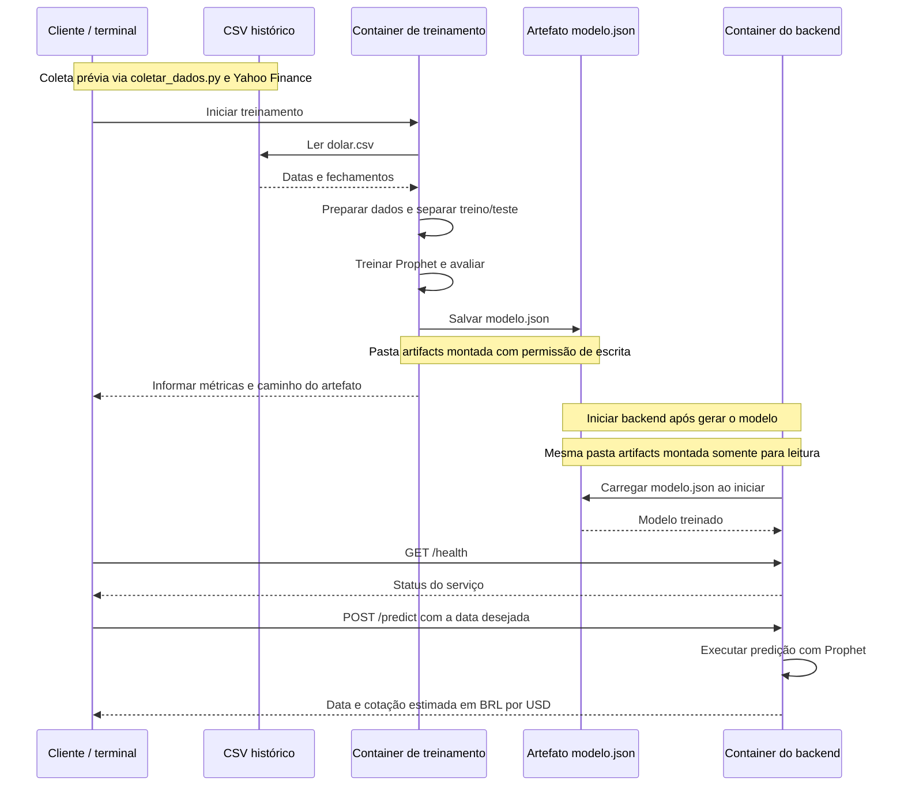

# Atividade-Ponderada-M7-2026-EC

**Nome:** Stefanne Victória Andrade Soares

## Objetivo e escolhas iniciais

Esta atividade tem como objetivo desenvolver uma solução para estimar a cotação futura do **dólar** em reais, utilizando dados históricos do [Yahoo Finance](https://finance.yahoo.com/quote/BRL%3DX/history/?period1=1672531200&period2=1791221071). 

- **Fonte dos dados:** Yahoo Finance, ticker [`USDBRL=X`](https://finance.yahoo.com/quote/BRL%3DX/history/?period1=1672531200&period2=1791221071).
- **Período e frequência:** diário, a partir de 01/01/2023 até 05/10/2026.
- **Colunas baixadas:** `date` e `close`.


## Arquitetura 

O diagrama representa o fluxo entre treinamento e inferência que será realizado. O container de treinamento lê o CSV histórico do dólar (baixado por um script pelo site do Yahoo), prepara os dados, separa treino e teste cronologicamente e treina o Prophet. Depois, salva o modelo em JSON na pasta artifacts. O container do backend acessa essa pasta somente para leitura e carrega o modelo ao iniciar. O usuário (cliente) pode verificar se o serviço está ativo e enviar uma data para receber a cotação estimada, sem executar novamente o treinamento.


## Modelo

> **Aviso:** Os códigos de scripts e outros foram desenvolvidos principalmente com o auxílio de Inteligência Artificial (IA) para aumentar a eficiência e manter o foco na lógica de desenvolvimento da atividade. 

O modelo escolhido foi o Prophet pois é uma ferramenta voltada à previsão de séries temporais e foi o sugerido pelo professor Murilo. Ele permite treinar com datas e valores históricos e exportar o modelo para uso no backend.

Seguindo a arquitetura acima, foi criado um script `scripts/coletar_dados.py` para baixar os dados históricos da cotação do dólar diretamente do site Yahoo Finance, dentro do período definido (01/01/2023 até 05/10/2026). Após isso, foi criado o script `scripts/treinar.py` que realiza o treinamento do modelo, avalia e salva métricas e previsões de teste. 

O treinamento foi colocado em um container para executar com o código e as dependências definidos na imagem. Os resultados são salvos em uma pasta compartilhada, permitindo que o backend carregue o modelo depois, sem precisar treinar ele de novo.

Separei os dados cronologicamente em 80% para treino e 20% para teste e calculei o MAE. Depois, treinei o modelo final com todo o histórico disponível para disponibilizá-lo no backend.

### Execução: 

1. No terminal, na raiz do projeto, construa a imagem:

```
docker build -f Dockerfile.treino -t dolar-treino:1.0 .
```


