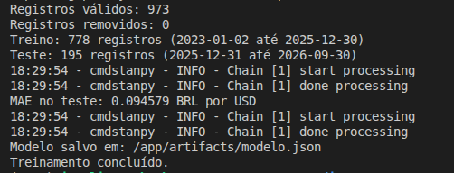

# DevLog 

-  Escolhi usar o dólar como moeda para previsão, utilizei os dados históricos do Yahoo Finance para pega pegar os dados dessa moeda, e utilizei IA para gerar o script para pegar esses dados.

- Criei venv e requirements.txt para baixar as dependências (como bibliotecas Python) que serão usadas.

- Rodei o script `scripts/coletar_dados.py` para baixar os dados.

- Após baixar os dados, planejei o diagrama de sequência UML e utilizei IA para gerar um em mermaid a partir da minha descrição.

- No diagrama coloquei o treinamento, o modelo salvo, o backend e o cliente. Defini que o treinamento salvaria o modelo na pasta `artifacts` e que o backend acessaria a pasta somente para leitura. Assim ele poderia carregar o modelo sem precisar treinar novamente.

- Utilizei a IA para me auxiliar na pesquisa de qual modelo poderia usar, mas no final selecionei a sugestão do professor: o Prophet.

- O Prophet usa séries temporais e permite usar datas e valores históricos para fazer previsões. Também permite salvar o modelo para carregar depois no back

- Após isso, utilizei IA para me auxiliar na criação do script para treinamento do modelo Prophet e já realizar a avaliação do mesmo. Essa avaliação prevê o período inteiro do teste de uma vez, não simula previsões de um dia a frente com atualização diária.

- Separei os dados cronologicamente sem embaralhar para usar os dados anteriores no treinamento e os posteriores no teste.

- Foi criado o arquivo `Dockerfile.treino` para adicionar o treinamento em um container

- O primeiro build da imagem falou pois na hora da execução faltou informar o contexto (.). Depois ajustei isso e consegui rodar o build, e também executei o treinamento (que gerou os 3 arquivos esperados corretamente).

- O resultado do treinamento foi: 

- Após isso eu decidi mudar o tempo de previsão porque achei que seria melhor ao comparar com o dia de hoje e ver se a tendência do modelo estava igual a tendência aparente que o valor de hoje indica. Então alterei o script de coletar dados para pegar dados mais recentes mas sem incluir o dia de hoje, e atualizei o modelo para ter a avaliação de uma próxima observação por vez, usando somente o passado. Além disso, também tem a comparação simples com o Naive para melhor análise das métricas

- A coleta ficou de 01/01/2023 até 05/10/2026, sem incluir a data final. Não incluí o dia atual já que a cotação ainda poderia mudar antes do fechamento. A última observação disponível ficou sendo 02/10/2026.

- Estou avaliando as últimas 20 observações, retreinando o modelo antes de cada observação

- A cada previsão, o modelo usa somente os dados anteriores à data prevista. Depois, o valor real dessa observação entra no histórico para a próxima rodada. A próxima observação não é necessariamente o próximo dia corrido, porque depende das datas disponíveis na base.

- O Naive usa o último fechamento observado como previsão para a próxima observação. Coloquei ele para comparar as métricas e ver se o Prophet teria um resultado melhor que uma abordagem mais simples.

- O resultado do modelo foi 


- Nenhum dado foi removido na limpeza, ficando com 973 registros válidos. O teste ficou com as últimas 20 observações, de 07/09/2026 até 02/10/2026.

| Métrica | Prophet | Naive |
|---|---:|---:|
| MAE | R$ 0,1110 | R$ 0,0218 |
| RMSE | R$ 0,1182 | R$ 0,0270 |

- O Naive teve menor erro nas duas métricas e em cada uma das 20 observações. As previsões do Prophet ficaram abaixo dos valores reais nesse período mas mesmo assim mantive o Prophet como modelo final para usar no backend e deixei o Naive apenas para comparação.

- Depois da avaliação, treinei o Prophet final com todo o histórico disponível e salvei em `artifacts/modelo.json`. Também foram salvos os arquivos `metricas.json`, `previsoes_teste.csv` e `previsao_futura.json`.

- A previsão para 05/10/2026 ficou em `R$ 5,04`. Durante o desenvolvimento, o dólar estava em aproximadamente `R$ 4,99`, mas o dia ainda não tinha fechado então essa comparação não entrou nas métricas do teste e não foi suficiente para concluir se o modelo acertou a tendência.


- Depois de finalizar o modelo, utilizei IA para me auxiliar na criação do backend em Python com Flask, no arquivo `backend/app.py`. Ele carrega o modelo salvo ao iniciar e usa esse modelo para responder às previsões sem treinar novamente a cada solicitação

- Foram criadas as rotas `GET /health`, para verificar se o serviço está ativo, e `POST /predict` para receber uma data e retornar a cotação prevista. A data precisa ser válida e posterior à última data usada no treinamento

- Foi criado o `Dockerfile.backend` para executar o backend em um segundo container Docker

- Juntei todas as dependências no `requirements.txt`

- Iniciei o backend na porta 8000, usando a pasta `artifacts` somente para leitura, como tinha definido na arquitetura.

- Testei a rota `/health` e ela retornou o status `ok`, o modelo `Prophet` e a última data do treinamento como `2026-10-02`. Isso confirmou que o serviço estava ativo e que o modelo tinha sido carregado.

- Depois testei a rota `/predict` pelo terminal com `curl`, enviando a data `2026-10-05`. O resultado foi:

```json
{"data":"2026-10-05","modelo":"Prophet","previsao":5.041988,"unidade":"BRL por USD"}
```


- Com essa resposta confirmei que a solicitação chegou ao backend e retornou uma previsão usando o modelo salvo. Usei o terminal como cliente para demonstrar essa comunicação 

- Por fim, atualizei o README com as explicações do modelo e do backend, os comandos e as evidências. O modelo usa somente o histórico de cotações, sem considerar notícias e outros fatores que afetam o dóla